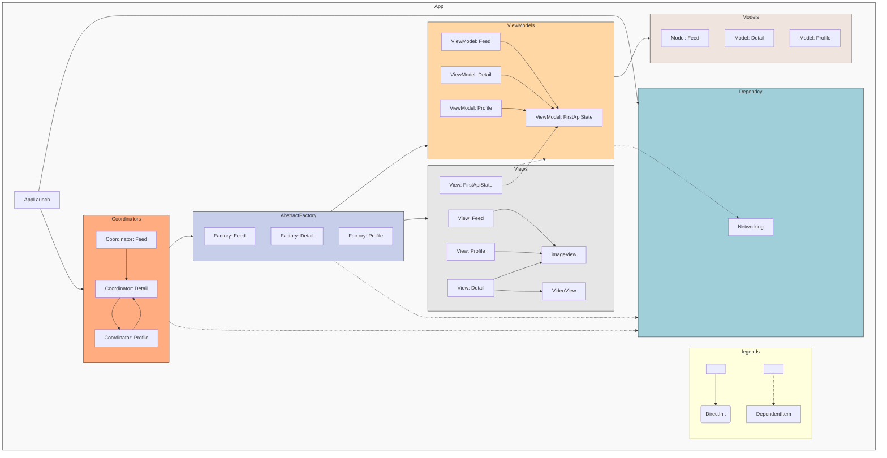

# Social Network

## Requirement
 Xcode 15.0 beta or later
 iOS - 17.0 or later
 The code uses beta version of xcode and iOS for learning 
 Third party: none
 
## Architecutre - MVVM-C

- Different subproject
- Service - Networking code
- Model
- View
- ViewModel
- Main App Coordinator
- DI

## Design Pattern 
### In coordianator
- Abstract factory for coordiantor which create view and view Model pair
- DI container struct contains various DI elements
- Cosntruction role, providing Depedncy is role of factory. 

## Flow

- Three coordinator one for each flow
- Each coordinator call related viewModel and view
- ViewModel make network call and interact with service
- Api detail are in ViewModel
- Network service are there
- Model are codable object with no logic
- View are swiftUI view
- Binding is via observable

## Perfomance
- Image Cached via CachedAsyncImage 
- Video perfomance via - Showing image thumb while video is loading to improve feel
- Video not cahced but only image. 
- Network response not cached as they change.

## Error Case handling
- Error in network call and retry are handled via FirstApiView and ApiCallLodable protocol and APIResultViewModel
- FirstApiView manages state like loading, error and retry and view for same
- APIResultViewModel maintian error, state of network call etc
- ApiCallLodable protocol declares that api call will be made.

## Themes
- Theme struct for changing color

## To do
- Support for dark mode

## Unfixed things
- Gitignore is not setup
- Naming correctness
- MeaningFul commit message and proper git workflow
- Linting
- UITesting
- Unit Testing
- Visual Diff Testing

## System Diagram App Launch Flow

